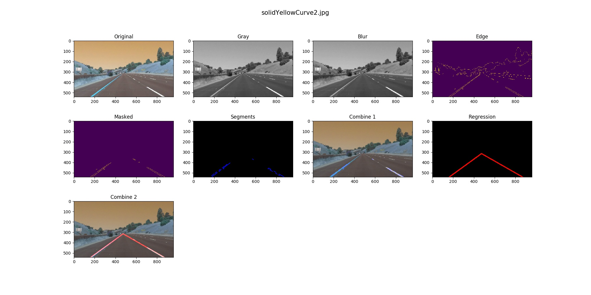

#**Finding Lane Lines on the Road** 

*This is a repository to accomplish the first project of a first term of [Udacity - Self-Driving Car Nanodegree](https://www.udacity.com/drive) that started in Feb. 2017.*

## Overview
---

When we drive, we use our eyes to decide where to go. The lines on the road that show us where the lanes are act as our constant reference for where to steer the vehicle. Naturally, one of the first things we would like to do in developing a self-driving car is to automatically detect lane lines using an algorithm.

In this project you will detect lane lines in images using Python and OpenCV. OpenCV means "Open-Source Computer Vision", which is a package that has many useful tools for analyzing images.

## Prerequisite
This project just uses Python and it's libraries, so you can use any OS to run this project. However, a lot of online advices are based on Linux generally. The choice is yours, but I'm using Ubuntu 16.04. So, if you have any trouble with this project under Ubuntu 16.04, contact me: <hanlsin@gmail.com>

* Python 2
You can download at <https://www.python.org>
I recommend you to use Python 2 for saving time. You can use Python3, but OpenCV doesn't have a prebuilt binary, so you have to build yourself.

* OpenCV
You can download at <http://opencv.org/>
If you have any trouble with Python+OpenCV, please see this <a href="http://docs.opencv.org/3.0-beta/doc/py_tutorials/py_tutorials.html">link</a>.
When you install OpenCV, you can check using Python terminal.
	  >>> import cv2
	  >>> print cv2.__version__
If you couldn't see any errors, you installed perfectly.

* Jupyter
You can download at <http://jupyter.org/>
However, I recommend you to use Python's package manager, pip, to install it.
	  $ pip install jupyter

* matplotlib
You can read the installin instruction through <http://matplotlib.org/users/installing.html>
You can install it using Python's package manage, pip.
	  $ pip install matplotlib

* Pillow
When using JPEG file, you need to install it.
You can install it using Python's package manage, pip.
	  $ pip install Pillow

* Numpy
You can install it using Python's package manage, pip.
	  $ pip install numpy

* moviepy
You can install it using Python's package manage, pip.
	  $ pip install moviepy

## Directories and Files
	--row_images[]
    |-row_movies[]
    |-README.md
    |-find_lane_lines.ipynb
    |-find_lane_lines.py
    |-test_raw_images.py
    |-test_raw_movies.py
    --writeup.md

This project contains directories and files as above.

* raw_images
This is a directory that contains images to test.

* raw_movies
This is a directory that contains movies to test.

* README.md
You are reading this file.

* find_lane_lines.ipynb
This file is a Jupyter Notebook. The content of thie file is test of functions in 'find_lane_lines.py' using images in 'raw_images' and moview in 'raw_movies'.

* find_lane_lines.py
This file contains the main code for this project.

* test_raw_images.py, test_raw_movies.py
These files are also test codes without Anaconda and Jupyter.

## Test
In this project, there is three test files.

* Python test file
You can execute these test files:
	  $ python test_raw_images.py
	  $ python test_raw_movies.py
* Jupyter Notebook
If you want to Jupiter Notebook, 'find_lane_lines.ipynb', you have to start Jupyter server.
	  $ jupyter notebook
When you execute the command above, your browser is showed up automatically. If not, you can connect manually through this address
	  http://localhost:8888
If you have a problem asking a password, you have to stop the Jupyter server, and follow this <a href="http://jupyter-notebook.readthedocs.io/en/latest/public_server.html">link</a>.
When you connect the Jupyter server, you can find your notebook file, 'find_lane_lines.ipynb', and now you can test.
